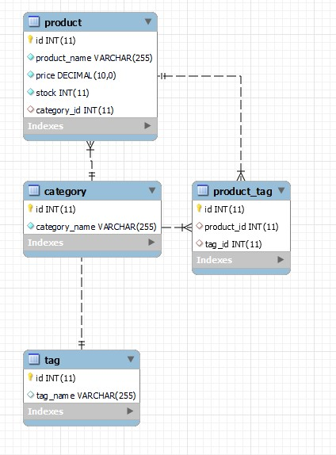
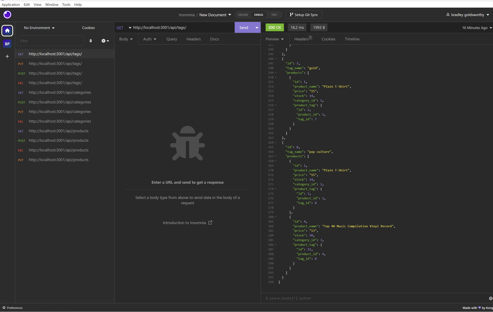
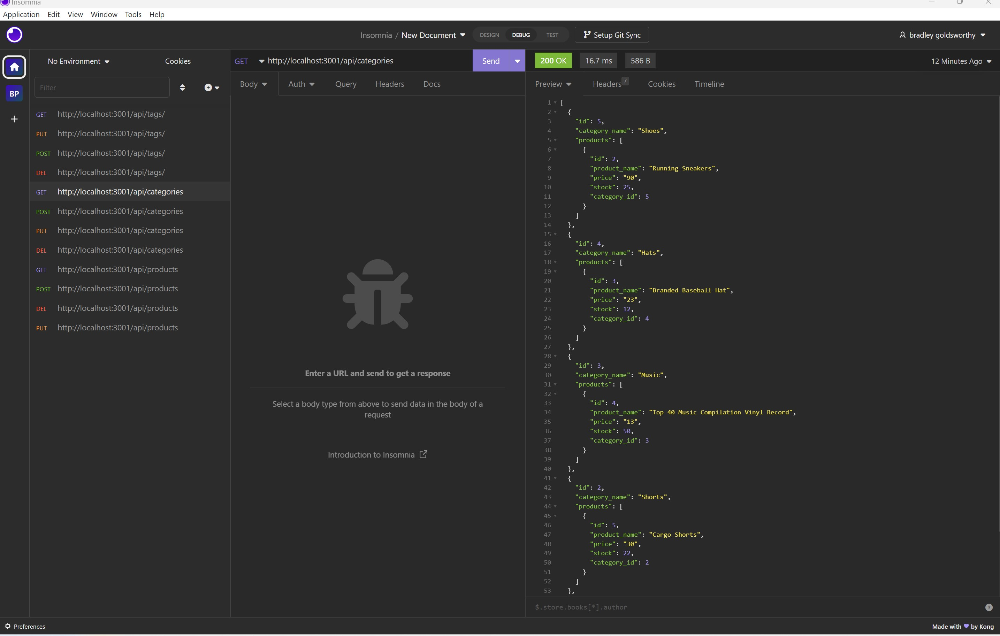

<h1 align="center">Object-Relational Mapping (ORM): E-Commerce Back End 👋</h1>
  
  
# Dream Home App Page

<p>
    
    
    
    
</p>

---

## Table of Contents
* [Description](#description)
* [Acceptance Criteria](#acceptance-criteria)
* [Schema](#schema)
* [Visuals](#visuals)
* [License](#license)
* [Installation](#installation)
* [Usage](#usage)
* [Contributing](#contribution)
* [Questions](#contact-information)

---

## Description

A mysql database and application backend for an e-commerce site. Built using MySQL2, Express, Sequelize and dotenv.

## User Story
  
```
AS A manager at an internet retail company
I WANT a back end for my e-commerce website that uses the latest technologies
SO THAT my company can compete with other e-commerce companies
```
  
## Acceptance Criteria
  
``` 
GIVEN a functional Express.js API
WHEN I add my database name, MySQL username, and MySQL password to an environment variable file
THEN I am able to connect to a database using Sequelize
WHEN I enter schema and seed commands
THEN a development database is created and is seeded with test data
WHEN I enter the command to invoke the application
THEN my server is started and the Sequelize models are synced to the MySQL database
WHEN I open API GET routes in Insomnia for categories, products, or tags
THEN the data for each of these routes is displayed in a formatted JSON
WHEN I test API POST, PUT, and DELETE routes in Insomnia
THEN I am able to successfully create, update, and delete data in my database
```
  
## Schema



## Video

* [Watch Video HERE](https://www.youtube.com/watch?v=JZ9jSlztxcQ)

## Visuals



---


---



---

## Installation
💾   
  
`npm init`

`npm install mysql2`

`npm install sequelize`

`npm install dotenv`

## License
  [](https://opensource.org/licenses/MIT)

  * For more information on license types, please reference this website
  for additional licensing information - [https: //choosealicense.com/](https://choosealicense.com/).

---

## Usage
💻   
  
Run the following command at the root of your project and answer the prompted questions:

`mysql -u root -p`

Enter PW when promted

`source db/schema.sql`

`quit`

`npm run seed`
  
`npm start`

## Contributing

  Not accepting contributions.

---

## Contact Information
  * GitHub Username: [BulkAcity](https://github.com/bulkacity)
  * GitHub Email: BG@bulkacity.com
  